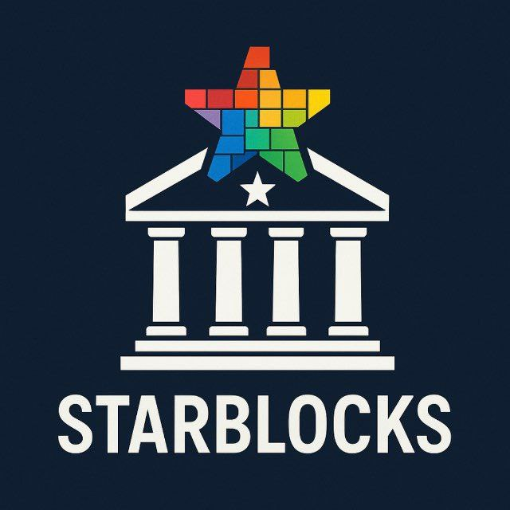

# StarBlocks

<p align="center">
  
</p>

StarBlocks es una plataforma web construida con Next.js 13, TypeScript y estilos custom (globals + variables) que conecta a recicladores urbanos con recolectores y registra cada entrega sobre la blockchain de BSV para garantizar trazabilidad y recompensas transparentes.

La identificación para la entrega de reciclaje se realiza mediante el uso de una llave NFC, que será entregada, una vez completado el registro, por el funcionario del ayuntamiento encargado del punto de recolección más cercano a su domicilio. Este registro puede realizarse online o presencialmente en el mismo punto de reciclaje. Alternativamente, los usuarios también pueden identificarse mediante un código QR visible en su página de usuario dentro de la plataforma. Así, cada entrega queda registrada en la blockchain, garantizando trazabilidad y recompensas transparentes para los usuarios.

## Visión de futuro: Red IoT de reciclaje inteligente

Actualmente, StarBlocks opera con un modelo de entrega manual en puntos de recolección atendidos por funcionarios. Sin embargo, la arquitectura de la plataforma está diseñada para escalar hacia una **red distribuida de dispositivos IoT** que automatizará y expandirá significativamente las capacidades del sistema:

- **Contenedores inteligentes**: Equipados con sensores de peso, lectores NFC/QR y conectividad, permitirán a los ciudadanos depositar residuos en cualquier momento del día. El contenedor identificará al usuario, pesará el material y registrará automáticamente la transacción en blockchain.
- **Camiones de recolección conectados**: Vehículos dotados de sistemas de pesaje y geolocalización que registrarán en tiempo real cada recogida, asociándola a rutas optimizadas y puntos de origen verificados.
- **Puntos de reciclaje autónomos (reverse vending machines)**: Máquinas de autoservicio para envases específicos (PET, latas, vidrio) que dispensarán recompensas instantáneas al usuario.
- **Sensores de llenado**: Monitorización del nivel de contenedores para optimizar rutas de recogida y reducir emisiones de la flota.
- **Dashboard municipal en tiempo real**: Panel de control para ayuntamientos con visualización de flujos de residuos, alertas de capacidad y métricas de impacto ambiental.

Esta evolución convertirá a StarBlocks en el **sistema operativo del reciclaje urbano**, donde cada interacción —desde el ciudadano hasta la planta de tratamiento— queda trazada, verificada y recompensada de forma transparente.

## Stack técnico

- **Frontend**: Next.js 13 App Router, Server Components + Client Components según necesidad, CSS modularizado en `globals.css`.
- **Backend/API**: API Routes (`src/app/api/*`) que exponen users, collectors, productTypes, transactions y leaderboard agregados.
- **Base de datos**: MongoDB Atlas. El helper `connectToDatabase` gestiona la conexión y `lib/types` tipa Users, Collectors, Transactions y privacidad granular.
- **Blockchain**: `lib/blockchain` usa la wallet de BSV y scripts OP_RETURN para inscribir cada transacción (`registerWasteOnChain`). El hash `txHash` viaja en el modelo y se muestra al usuario para verificación.
- **Autenticación**: NextAuth (credenciales) con roles `user` y `collector`. Los dashboards usan `useSession` y redirecciones condicionales.
- **UI Reusable**: Componentes como `StarBlocksGame`, `PointsTracker`, `UserRecyclingExperience`, `SiteFooter`, `AuthNav`, etc. Animaciones accesibles (prefers-reduced-motion), skip-link global y semántica ARIA.

## Esquema de arquitectura

```
┌────────────────────────────────────────────────────────────────────┐
│                         Aplicación StarBlocks                      │
│                                                                    │
│  Frontend (Next.js 13, TypeScript, CSS)                            │
│  ┌──────────────────────────────────────────────────────────────┐  │
│  │ Pages & Layout                                               │  │
│  │  - Landing (marketing, CTA, inline footer)                   │  │
│  │  - Dashboard usuario (StarBlocksGame, PointsTracker)          │  │
│  │  - Dashboard recolector (registro, tabla, leaderboard CTA)   │  │
│  │  - Leaderboard (agregaciones geográficas por material)       │  │
│  │  - Formularios (login, registro, registro recolector)        │  │
│  └──────────────────────────────────────────────────────────────┘  │
│                      │                                             │
│                      ▼                                             │
│  Componentes UI reutilizables                                      │
│  ┌──────────────────────────────────────────────────────────────┐  │
│  │ - AuthNav, SiteFooter, GlobalFooter                           │  │
│  │ - StarBlocksGame, PointsTracker, RecyclingGraph               │  │
│  │ - CustomSelect, UserRecyclingExperience                       │  │
│  │ - Context Providers, skip-link, estilos globales              │  │
│  └──────────────────────────────────────────────────────────────┘  │
│                                                                    │
│  API Routes (Next.js)                                              │
│  ┌──────────────────────────────────────────────────────────────┐  │
│  │ - /api/users, /api/collectors, /api/products                  │  │
│  │ - /api/transactions (GET/POST, integra blockchain)            │  │
│  │ - /api/leaderboard (aggregations con MongoDB)                 │  │
│  └──────────────────────────────────────────────────────────────┘  │
│                      │                                             │
│                      ▼                                             │
│  Servicios internos                                                │
│  ┌──────────────────────────────────────────────────────────────┐  │
│  │ - MongoDB Atlas (colecciones: users, collectors,               │ │
│  │   productTypes, transactions)                                  │ │
│  │ - `lib/mongodb` (conexión y helper)                            │ │
│  │ - `lib/blockchain` (registro OP_RETURN y wallet BSV)           │ │
│  │ - NextAuth (sesiones user/collector)                           │ │
│  └──────────────────────────────────────────────────────────────┘  │
│                                                                    │
│  Integraciones externas                                            │
│  ┌──────────────────────────────────────────────────────────────┐  │
│  │ - Blockchain BSV (escritura de tx y verificación futura)       │ │
│  │ - Wallet service (firmas y addresses)                          │ │
│  │ - MongoDB Atlas cluster                                        │ │
│  └──────────────────────────────────────────────────────────────┘  │
└────────────────────────────────────────────────────────────────────┘
```

## Diseño e interacción

- **Home / Landing**: Panel hero con animaciones de la estrella, CTA primario/secundario y pie de página legal. Emula un HUD urbano y muestra la narrativa.
- **Dashboard usuario**: Nave con header, panel de credenciales, wallet copy, sección de estadísticas (StarBlocksGame, PointsTracker), timeline de bloques y accesos a datos sensibles mediante un panel que actúa como modal.
- **Dashboard recolector**: Header distintivo, formulario para registrar recolecciones (con validaciones, selects dependientes), tabla en vivo de transacciones y llamado a un leaderboard de ubicaciones.
- **Leaderboard**: Página dedicada accesible desde el CTA para recolectores. Consulta `/api/leaderboard` y muestra rankings segmentados por material con gradientes y tarjetas responsive.
- **Accesibilidad (WCAG 2.2)**: Cumple con los principales criterios de WCAG 2.2, incluyendo:
  - Navegación completa por teclado (skip-link, focus visible, gestión de tabulación).
  - Roles y atributos ARIA en formularios, paneles y animaciones (`aria-live`, `role="alert"`, `aria-label`).
  - Contraste de colores AA en textos y botones, con variables CSS para ajustes.
  - Alternativas textuales y semántica en imágenes y elementos visuales.
  - Soporte para `prefers-reduced-motion` en animaciones.
  - Mensajes de error accesibles y notificaciones en tiempo real.
  - Validaciones y feedback accesible en formularios.
Esto garantiza que la plataforma es usable y comprensible para personas con distintas capacidades, conforme a los estándares internacionales de accesibilidad web.

## Funcionalidad y flujo

1. **Registro / Login de usuarios**: Formularios con validaciones mínimas, asistencia para colectores y manejo de errores en vivo.
2. **Registro de recolectores**: Form de múltiples campos con cascadas (comunidad → provincia → municipio) usando `CustomSelect`.
3. **Registro de transacciones**: El recolector ingresa wallet del usuario, selecciona material y kilos; el backend verifica datos, calcula puntos y escribe en blockchain. La tabla y timeline se actualizan vía `aria-live`.
4. **Experiencia del usuario**: Visualiza su progreso en bloques (StarBlocksGame), ranking por material (PointsTracker) y cronología (RecyclingGraph). Panel seguro para obtener llave privada mediante confirmación de contraseña.
5. **Leaderboard dinámico**: Agregación de transacciones por categoría y ubicación, mostrando top 5 ubicaciones por material.

## Problema e impacto

Las cadenas de reciclaje sufren falta de trazabilidad y baja confianza entre ciudadanos y operadores. StarBlocks:

- **Transparencia**: Cada entrega genera un hash blockchain verificable (Whatsonchain). Usuarios y administraciones pueden auditar el flujo.
- **Gamificación + recompensas**: Cada kilo es un bloque; completar categorías llena la estrella y habilita futuras recompensas. Se fomenta la constancia.
- **Datos abiertos**: Leaderboard por categorías y regiones revela qué comunidades son más activas, incentivando competencia positiva y políticas públicas basadas en datos.
- **Privacidad configurable**: Usuarios pueden decidir si participan en rankings o comparten datos, alineándose con normativas locales.

## Trazabilidad del reciclaje

La app documenta cada recolección con:

- Usuario (wallet y nombre), recolector (zona, empresa), material (productType), kilos y puntos.
- Hash blockchain (`txHash`) para cada registro `validated`.
- API `/api/transactions` para consultar por usuario o recolector; `useRecyclingHistory` alimenta dashboards y timeline.
- Leaderboard cruzado con geografía (council/province/community) para visibilidad territorial.

## Próximas funcionalidades

- **Validación on-chain**: Endpoint `verifyTransaction` pendiente de implementar para comprobar el estatus de cada hash.
- **Notificaciones en tiempo real**: WebSockets o SSE para avisar al instante nuevos registros y movimientos en ranking.
- **Capas de IA / predicción**: Sugerir rutas óptimas a recolectores o recompensas personalizadas según hábitos.
- **Apps móviles / NFC**: Integración nativa para escanear residuos, leer chips y registrar sin fricción.
- **Panel administrativo**: Estadísticas globales, exportaciones y controles de privacidad per user.

## Instalación rápida

1. **Instalar dependencias**
   ```bash
   npm install
   ```
2. **Configurar variables**
   ```bash
   cp .env.example .env.local
   # Editar MONGODB_URI, credenciales NextAuth, wallet BSV, etc.
   ```
3. **Ejecutar**
   ```bash
   npm run dev
   ```
   Visita http://localhost:3000

## API Endpoints

| Método | Endpoint | Descripción |
|--------|----------|-------------|
| GET | `/api/users` | Lista usuarios |
| POST | `/api/users` | Crear usuario |
| GET | `/api/waste` | Lista registros de basura |
| POST | `/api/waste` | Registrar basura |
| PATCH | `/api/waste/[id]` | Marcar como recolectado |

### Public API (Developers)

Estas APIs son accesibles públicamente para que cualquier otro municipio o desarrollador pueda integrar los datos de StarsBlocks en otras aplicaciones.

| Método | Endpoint | Descripción |
|--------|----------|-------------|
| GET | `/api/public/stats` | Estadísticas globales de impacto (kg, puntos, txs) |
| GET | `/api/public/products` | Lista de materiales aceptados y su valor |
| GET | `/api/public/leaderboard` | Top 10 recicladores (solo iniciales por privacidad) |

#### Ejemplos de Respuesta

**GET /api/public/stats**
```json
{
  "total_recycled_kg": 279,
  "total_points_issued": 276.56,
  "total_transactions": 11,
  "timestamp": "2025-11-30T08:28:04.207Z"
}
```

**GET /api/public/products**
```json
{
  "products": [
    {
      "name": "PET (Botellas plástico)",
      "points_per_kg": 0.35,
      "description": "Recycle PET (Botellas plástico) to earn 0.35 points per kg."
    }
  ]
}
```

**GET /api/public/leaderboard**
```json
{
  "leaderboard": [
    {
      "name": "S.M.",
      "points": 156.51,
      "recycled_kg": 178
    },
    {
      "name": "A.L.",
      "points": 120.05,
      "recycled_kg": 101
    }
  ]
}
```
*Nota: Los nombres se muestran como iniciales para proteger la privacidad de los usuarios.*
